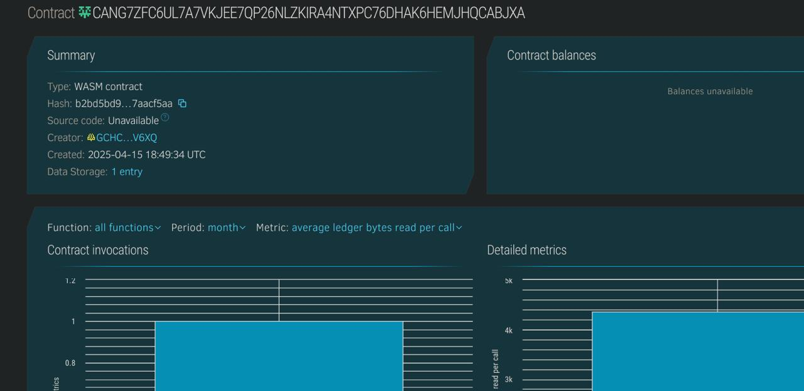

**Blockchain Rock Paper Scissors**

---

## **Project Description**
"Blockchain Rock Paper Scissors" is a simple decentralized game on the Stellar blockchain using the Soroban SDK. In this game, two players can create a game, choose their moves (Rock, Paper, or Scissors), and the contract will determine the winner. All game data is securely stored on the blockchain for transparency and fairness.

---

## **Project Vision**
To showcase the power of blockchain for creating secure, decentralized games. This project aims to demonstrate how smart contracts can be used to build transparent and fair gaming experiences.

---

## **Key Features**
- **Create Game**: Players can create a new game by specifying two players.
- **Play Move**: Each player submits their move (Rock, Paper, or Scissors).
- **Winner Determination**: The contract automatically calculates the winner based on the game rules.
- **Blockchain Data**: All game data, including moves and results, is securely stored on the blockchain.

---

## **Future Scope**
- **Multiple Rounds**: Support for multiple rounds within one game.
- **Betting System**: Allow players to stake coins and win the pot.
- **Leaderboard**: Track and display the top players based on wins.
- **AI Opponent**: Add an AI opponent for solo play.

---

## Contract Details
CANG7ZFC6UL7A7VKJEE7QP26NLZKIRA4NTXPC76DHAK6HEMJHQCABJXA
